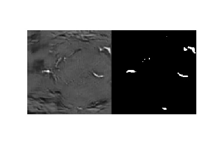
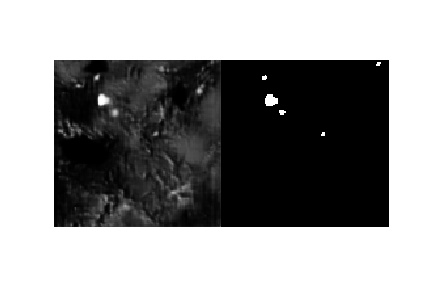
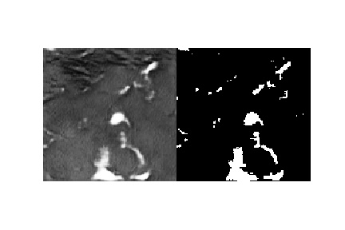
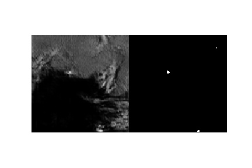
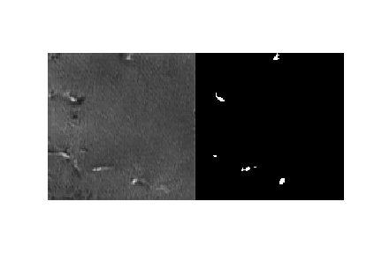
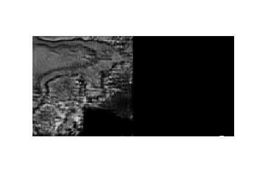
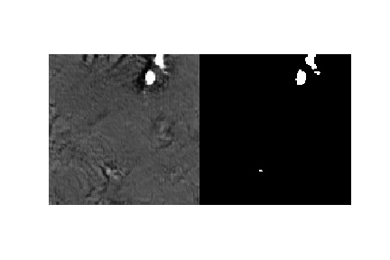
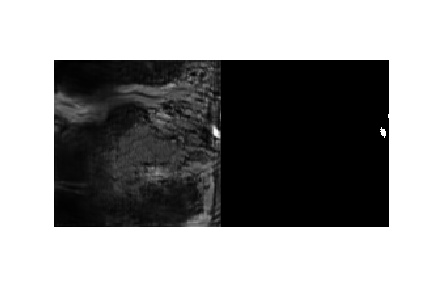
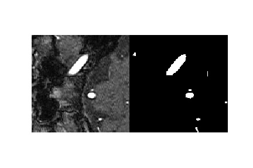
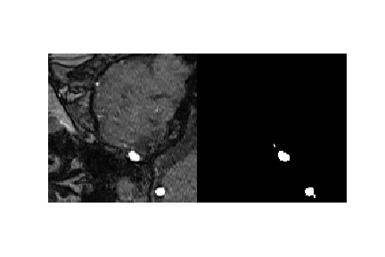

## **This is the official code for "Generating 3D TOF-MRA Volumes and Segmentation Labels using Generative Adversarial Networks with Mixed Precision" - Subramaniam et al. 2021 - under review**

**Aim:** Generating reasonable looking 3D TOF-MRA patch-label pairs. Utilizing mixed precision for improving the quality and performance of the patch-label pairs

**Datasets used:** PEGASUS study (72) - 47 (train), 12 (val), 13 (test); 1000Plus study (20) - used for testing purposes only

**Folders:**
* **data_processing:** contains modules used for extraction of patches, and applying skull-stripping

* **evaluation:** contains modules related to evaluation methods: Precision and Recall for Distribution (PRD) and Fréchet Inception Distance (FID), and modules related to extracting embedded features for evaluation purposes under the MedicalNet folder under evaluation

* **Images:** Images used below for documentation purposes

**Files:**
* **config.py:** configuration parameters used for training different GAN varieties: 
    * GP model
    * SN model
    * SN-MP model
    * c-SN-MP model
    * DPGAN
    Also contains config parameters to continue training and generate images from saved models; the config parameter changes required to run DPGAN are specified as comments in the file

* **dataset.py:** contains custom pytorch dataset class GANDataset as the each patch/label needs to be read from independent zipped files

* **utils.py:** contains helper functions for training - inline documentation of the functions available in the code

* **train.py:** training code for all the GANs

* **generate.py:** generate patches using the saved models; config file can be used to change model and epoch numbers

* **evaluate.py:** evaluation with FID and PRD

* **DPGAN_train.py:** training code for DPGAN preliminary results in supplementary material

**Input:**
Generator - Noise vector of size 128
Critic - output of generator (fake patch-label pair) or PEGASUS pairs (real patch-label pair).

**Output:** 
Generator - Generated patch and label pair
Critic - Critic's score used to train the generator and critic

**Hyperparameters:**

* Noise vector of 128
* Adam optimizer for both discriminator generator for all architectures
* LR: two-time scale update rule [(Heusel et al., 2018)](https://arxiv.org/pdf/1706.08500.pdf)
     Critic = 0.0004; Generator = 0.0002 for all models
* Beta_1 = 0 and beta_2 = 0.9
* Max number of features for critic and discriminator as ndf and ngf respectively: 
    * 512 for GP, SN, and SN-MP
    * 1024 for c-SN-MP

**Results:**

Sample images of mid-axial slice of patch-label pairs, and the corresponding 3D vessel structure from A: GP model; B: SN model; C: SN-MP model; D: c-SN-MP model; E: Real

Samples of 3D volumes in axial view as GIFs:

GP:

SN:

SN-MP:

c-SN-MP:

Real:

